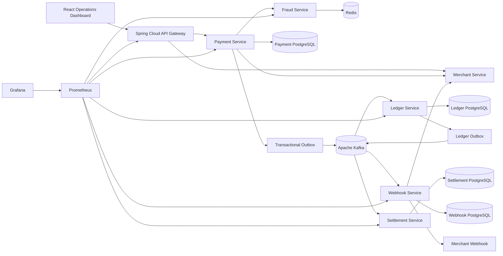

# AegisPay Platform

Production-style distributed payment processing, real-time fraud detection, double-entry ledger, settlement, webhook delivery and merchant operations platform.

> Flagship Java system-design project focused on correctness under retries, partial failures, duplicate events and independent service scaling.

## Architecture



## Why this is not a CRUD demo

AegisPay deliberately models distributed-system failure cases:

- **Idempotent payment APIs** prevent duplicate charges on client retries.
- The idempotency key is tied to a SHA-256 request fingerprint; reusing a key with a different payment intent returns a conflict.
- **Merchant API-key authentication** is validated before payment processing. Keys are only returned when a merchant is created.
- **Redis velocity rules** perform real-time risk scoring.
- **Transactional outbox** persists business state and the event to publish in the same database transaction.
- Kafka consumers assume **at-least-once delivery** and use idempotent processing.
- **Immutable double-entry accounting** records equal debit and credit entries for each completed payment.
- Settlement processing is asynchronous and independently scalable.
- Merchant webhooks are HMAC-SHA256 signed and use exponential retry before entering a terminal DEAD state.
- Every service exposes Actuator health and Prometheus metrics.
- Kubernetes manifests include readiness probes, resource requests and horizontal autoscaling for critical services.

## Implemented microservices

| Service | Port | Responsibility |
|---|---:|---|
| API Gateway | 8080 | Edge routing and correlation IDs |
| Merchant Service | 8082 | Merchant onboarding, API keys, webhook configuration |
| Payment Service | 8081 | Idempotency, payment lifecycle, fraud orchestration, transactional outbox |
| Fraud Service | 8083 | Redis-backed velocity and risk rules |
| Ledger Service | 8084 | Idempotent Kafka consumer, immutable double-entry ledger, ledger outbox |
| Settlement Service | 8085 | Creates and processes merchant settlements |
| Webhook Service | 8086 | Durable signed merchant webhook delivery with retries |

The repository also contains a React operations dashboard, shared event contracts, Docker images, Docker Compose, GitHub Actions, Kubernetes manifests, Prometheus/Grafana provisioning and k6 load tests.

## Technology stack

### Backend
- Java 21
- Spring Boot 4.1.1
- Spring Cloud 2025.1.3
- Spring MVC / WebFlux Gateway
- Spring Data JPA
- Spring Kafka
- Spring Data Redis
- PostgreSQL
- Redis
- Apache Kafka

### Frontend
- React 19.3
- TypeScript
- Vite 8.3

### Platform
- Docker / Docker Compose
- Kubernetes + HPA + Kustomize
- GitHub Actions
- GHCR
- Prometheus
- Grafana
- k6

## Main payment flow

```text
Client
  |
  | POST /api/payments
  | X-API-Key
  | Idempotency-Key
  v
API Gateway
  |
  v
Payment Service --------> Merchant Service
  |                        validate API key
  |
  +---------------------> Fraud Service -----> Redis
  |                         risk decision
  |
  | local DB transaction
  +---- Payment = SUCCEEDED
  +---- OutboxEvent = payments.completed
  |
  v
Outbox Publisher
  |
  v
Kafka: payments.completed
  |                         |
  v                         v
Ledger Service          Webhook Service
  |                         |
  | balanced entries        | retry + HMAC
  v                         v
ledger_db               Merchant endpoint
  |
  | ledger.posted
  v
Kafka
  |
  v
Settlement Service
  |
  v
settlement_db
```

## Financial invariant

For every ledger transaction:

```text
sum(DEBIT entries) == sum(CREDIT entries)
```

Historical ledger entries are not updated. Corrections should be represented by compensating/reversing entries so financial history remains auditable.

## Run locally

Requirements:

- Docker Desktop / Docker Engine with Compose
- Git

Clone and start the full stack:

```bash
git clone https://github.com/naveed24/aegispay-platform.git
cd aegispay-platform
docker compose up --build
```

Local endpoints:

| Component | URL |
|---|---|
| Operations Dashboard | http://localhost:3000 |
| API Gateway | http://localhost:8080 |
| Prometheus | http://localhost:9090 |
| Grafana | http://localhost:3001 |

Grafana development credentials are `admin / admin`. They are only for the local Compose environment.

### 1. Create a merchant

```bash
curl -X POST http://localhost:8080/api/merchants \
  -H "Content-Type: application/json" \
  -d '{"name":"Aegis Demo Store","webhookUrl":"https://example.com/aegispay/webhook"}'
```

The response contains the merchant ID and an `apiKey`. The public merchant list does **not** expose API keys.

### 2. Create a payment

```bash
curl -X POST http://localhost:8080/api/payments \
  -H "Content-Type: application/json" \
  -H "X-API-Key: <api-key>" \
  -H "Idempotency-Key: 8528bcc0-c9a1-46c7-8441-d818cab6da2a" \
  -d '{"merchantId":"<merchant-id>","amount":2500,"currency":"INR"}'
```

Retry the same request using the same idempotency key. AegisPay returns the existing payment instead of creating a second one.

Try reusing the key with a different amount; the service returns an idempotency conflict.

For the rule engine, submit more than five payments for one merchant in a minute or submit a payment of at least `100000`.

## Build without Docker

Backend:

```bash
mvn clean verify
```

Frontend:

```bash
cd frontend/merchant-dashboard
npm install
npm run build
```

## Load test

Install k6 and export a real merchant ID/API key from the create-merchant response:

```bash
k6 run \
  -e MERCHANT_ID=<merchant-id> \
  -e API_KEY=<api-key> \
  load-tests/payment-flow.js
```

The script contains example thresholds for HTTP failure rate and p95 latency. Treat benchmark numbers as valid only after running them on a defined machine/environment.

## Kubernetes

The base manifests live in:

```text
infrastructure/kubernetes/base/
```

Render them with:

```bash
kubectl kustomize infrastructure/kubernetes/base
```

The checked-in database endpoints and secrets in the Kubernetes examples are placeholders. Production deployments should use managed PostgreSQL/Kafka/Redis, an external secret manager and environment-specific overlays.

## Repository structure

```text
aegispay-platform/
├── libs/
│   └── event-contracts/
├── services/
│   ├── api-gateway/
│   ├── merchant-service/
│   ├── payment-service/
│   ├── fraud-service/
│   ├── ledger-service/
│   ├── settlement-service/
│   └── webhook-service/
├── frontend/
│   └── merchant-dashboard/
├── infrastructure/
│   ├── docker/
│   └── kubernetes/
├── monitoring/
│   ├── prometheus/
│   └── grafana/
├── load-tests/
├── docs/
│   ├── adr/
│   ├── api/
│   └── architecture/
├── .github/workflows/
├── docker-compose.yml
└── pom.xml
```

## Architectural decisions

See:

- `docs/architecture/README.md`
- `docs/adr/0001-microservices-and-event-driven.md`
- `docs/adr/0002-double-entry-ledger.md`
- `docs/api/examples.md`
- `SECURITY.md`

## CI/CD

On pushes and pull requests, GitHub Actions:

1. sets up Java 21,
2. runs `mvn verify`,
3. installs the dashboard dependencies,
4. builds the React application.

A separate workflow builds each service image and publishes it to GHCR on changes to service/frontend code.

## Engineering extensions

The current repository implements the end-to-end payment, fraud, ledger, settlement and webhook path. Strong next increments are:

- processor/bank adapter with ambiguous `UNKNOWN` payment state and reconciliation
- refunds and compensating ledger transactions
- OAuth2/OIDC for the operations dashboard
- OpenTelemetry traces + Tempo/Loki
- Debezium CDC outbox relay as an alternative to scheduled publishers
- contract tests and Testcontainers integration tests
- multi-region/event partition strategy
- reconciliation file ingestion and discrepancy cases
- managed-cloud Terraform environments

These are intentionally listed as extensions rather than being presented as already implemented.

## Security note

The Compose credentials and webhook signing key are development values only. Never use them in a real environment. See `SECURITY.md`.
